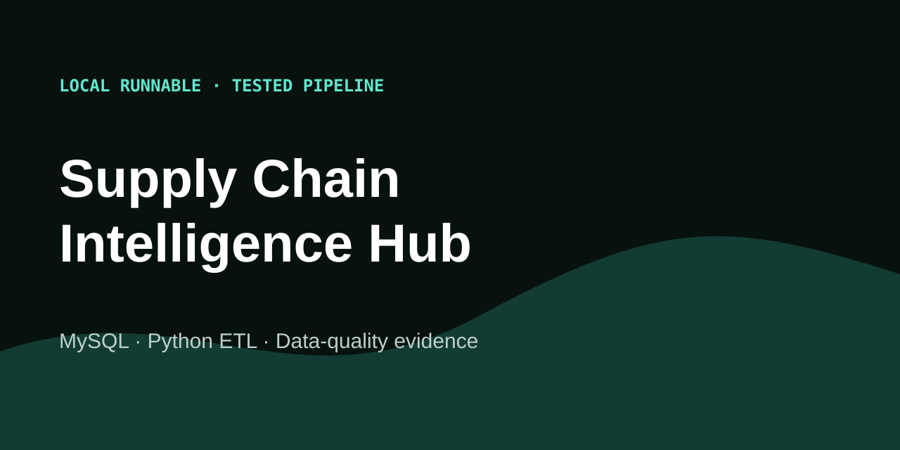

# Supply Chain Intelligence Hub

**A reproducible MySQL and Python pipeline that turns exactly 101,786 deterministic source records into validated, filterable supply-chain decisions.**



[Try the dashboard](https://caio-felice-cunha.github.io/Supply-Chain-Intelligence-Hub/) · [Engineering case](https://caio-felice-cunha.github.io/Supply-Chain-Intelligence-Hub/#engineering) · [View source](https://github.com/Caio-Felice-Cunha/Supply-Chain-Intelligence-Hub) · [Run locally](#run-the-complete-pipeline)

## 60-second walkthrough

1. Change period, warehouse, category, or supplier in the dashboard.
2. Watch revenue, units, delivery, stock risk, seasonality, inventory health,
   and supplier results recompute from one aggregate cube.
3. Open the pipeline lineage and rule-level quality report.
4. Inspect table samples or download the full CSV bundle with its manifest,
   schema, seed, and SHA-256 checksums.

The Pages interface is deliberately read-only. The operational source of truth
is the CLI; the dashboard only observes versioned artifacts.

## Release dataset

Seed `42` covers `2024-07-01` through `2026-06-30` and creates:

| Source table | Grain | Rows |
|---|---|---:|
| `suppliers` | one supplier | 30 |
| `products` | one SKU | 150 |
| `warehouses` | one distribution centre | 6 |
| `inventory` | SKU × warehouse × month | 21,600 |
| `sales` | one sale transaction | 70,000 |
| `orders` | one purchase order | 8,000 |
| `price_history` | one effective supplier price | 2,000 |
| **Total** | seven source tables | **101,786** |

The data models ABC demand classes, seasonal demand, promotions, supplier lead
times and reliability, price movement, delivery delays, and inventory risk.
Controlled demand spikes, extreme delays, price jumps, and stock-risk snapshots
exercise the rules and visual states. Primary keys, foreign keys, non-negative
measures, and formula integrity remain valid.

## Architecture

```text
seeded generator
      │
      ▼
seven MySQL source tables ──► extract ──► lossless transform
                                              │
                                              ▼
                               cross-table data contracts
                                              │
                       ┌──────────────────────┴─────────────────────┐
                       ▼                                            ▼
             seven processed tables                     aggregate JSON cube
                                                                    │
                                        ┌───────────────────────────┼───────────┐
                                        ▼                           ▼           ▼
                                  Pages dashboard            quality report   ZIP + hashes
```

The browser filters monthly aggregates at this grain:

```text
period × warehouse × category × supplier
```

It never downloads the 100k-row source dataset during normal use. This keeps
the public experience fast while the complete evidence remains downloadable.

## Pipeline workflow

The release command executes eight observable stages:

1. **Generate** all seven tables from one NumPy random generator.
2. **MySQL load** source rows into constrained relational tables.
3. **Extract** each table back in primary-key order.
4. **Transform** dates and add inventory, delivery, and revenue fields without
   changing row counts.
5. **Validate** exact counts, PKs, FKs, measures, dates, formulas, anomalies,
   and source/processed parity.
6. **Processed load** all seven transformed tables.
7. **Aggregate** sales, orders, and inventory to the browser cube.
8. **Publish** dashboard JSON, samples, report, archive, schema, manifest, and
   SHA-256 evidence.

Every stage records state, input rows, output rows, and duration in
[`pipeline-run.json`](https://caio-felice-cunha.github.io/Supply-Chain-Intelligence-Hub/data/pipeline-run.json).

## KPI logic

| KPI | Formula | Important boundary |
|---|---|---|
| Revenue | `Σ(quantity_sold × unit_price)` | rounded per sale, then summed |
| Units | `Σ(quantity_sold)` | selected sales facts only |
| On-time delivery | `on_time_orders / completed_orders × 100` | in-transit orders excluded |
| At-risk SKUs | distinct `product_id` where `available / reorder_level < 0.5` | selected end period |
| Inventory health | `available / reorder_level` | critical `<0.5`, low `<1`, optimal `<3`, excess otherwise |

The Python implementation lives in
[`scripts/analytics/kpis.py`](scripts/analytics/kpis.py); browser calculations
are parity-tested against its aggregate contract.

## Real code worth inspecting

- [`scripts/generation/synthetic.py`](scripts/generation/synthetic.py) — fixed
  scales, seeded business distributions, seasonality, promotions, and anomalies.
- [`scripts/orchestration/demo.py`](scripts/orchestration/demo.py) — public CLI.
- [`scripts/orchestration/pipeline.py`](scripts/orchestration/pipeline.py) —
  MySQL round-trip, stage telemetry, aggregation, and publication.
- [`scripts/quality/contracts.py`](scripts/quality/contracts.py) — exact counts,
  uniqueness, referential integrity, measures, formulas, and parity contracts.
- [`sql/1-init.sql`](sql/1-init.sql) — relational schema, checks, FKs, and indexes.
- [`sql/3-Stored-Procedures.sql`](sql/3-Stored-Procedures.sql) — inventory
  health, supplier delivery, and rolling-sales procedures anchored to dataset dates.
- [`site/app.js`](site/app.js) — dependency-free, accessible browser filtering.

The legacy `scripts.orquestration` package remains as a temporary import shim;
new code uses the corrected `scripts.orchestration` spelling.

## Run the complete pipeline

Prerequisites: Python 3.11+ and Docker Desktop/Engine.

```bash
git clone https://github.com/Caio-Felice-Cunha/Supply-Chain-Intelligence-Hub.git
cd Supply-Chain-Intelligence-Hub
python -m pip install -r requirements-dev.txt
docker compose up -d --build --wait mysql
python -m scripts.orchestration.demo \
  --scale portfolio \
  --seed 42 \
  --output site
```

Local Compose exposes MySQL at `127.0.0.1:3307`. The checked-in credentials are
isolated demo defaults, not production secrets. Override `DB_HOST`, `DB_PORT`,
`DB_USER`, `DB_PASSWORD`, and `DB_NAME` as needed.

For a fast pull-request check:

```bash
python -m scripts.orchestration.demo \
  --scale smoke --seed 42 --output _smoke_site --database skip
```

`--database skip` is intentionally limited to offline tests. The published
release and the MySQL CI job use the real database path.

## Tests and release gates

```bash
python -m pytest
npm install
npm run test:e2e
docker compose config --quiet
```

The suite covers exact release counts, deterministic frames and ZIP hashes,
foreign keys, business constraints, anomaly counts, KPI parity, CLI artifacts,
existing ETL/quality modules, desktop/mobile Pages, keyboard navigation,
reduced motion, downloads, external network requests, and console errors.

CI runs three independent jobs: Python/contracts, committed Pages browser tests,
and a smoke-scale MySQL round-trip. The Pages workflow regenerates all 101,786
rows through MySQL before deployment.

## Project structure

```text
scripts/
├── generation/       deterministic source data
├── etl/              connection, extract, transform, validate, load primitives
├── orchestration/    public CLI, pipeline, publisher, static source
├── orquestration/    deprecated compatibility shim
├── analytics/        aggregate cube and KPI contracts
└── quality/          rules, profiling, anomalies, reports, cross-table contracts
sql/                  MySQL schema, seed compatibility data, stored procedures
site/                 generated dashboard, report, samples, ZIP, hashes
tests/                unit, integration, parity, CLI, and Playwright checks
```

## Limitations

- The dataset is synthetic and intentionally shaped for engineering coverage;
  it does not describe a real company or prove commercial performance.
- The dashboard is descriptive, not a forecasting or order-optimization engine.
- Stage durations vary by machine and are evidence of execution, not a benchmark.
- The historical notebooks and small quality report remain learning artifacts;
  the CLI and `site/` release are the current public contract.

## Security and license

The public dataset contains no customer, employee, credential, or client data.
The dashboard performs no external writes and needs no login, API key, payment,
analytics endpoint, or hosted database. Code is licensed under [MIT](LICENSE).
